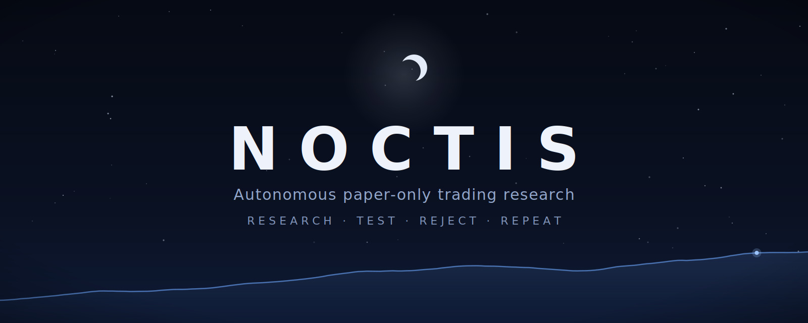

<div align="center">



<!-- Live workflow/coverage badges 404 on a private repo (GitHub's image proxy fetches anonymously).
     At public release, restore the live CI badge and swap the static coverage badge for codecov:
     [](https://github.com/bmeunier1974/agent-trader/actions/workflows/ci.yml)
     The static coverage number is real: `pytest --cov=noctis` → 93% (2026-07-15); re-measure before bumping. -->
[](https://github.com/bmeunier1974/agent-trader/actions/workflows/ci.yml)
[](docs/development.md)
[](https://www.python.org/)
[](LICENSE)
[](https://docs.astral.sh/ruff/)
[](https://mypy-lang.org/)
[](https://github.com/astral-sh/uv)
[](docs/safety.md)

</div>

**Noctis** is an autonomous, **paper-only trading research system**. While the market is
closed it designs and evaluates new trading strategies using an LLM, walk-forward
validation, and out-of-sample testing. While the market is open it deploys only the
strategies that survived, into a continuous paper account that builds a genuine forward
performance record. At the close it publishes a report, updates its memory, and returns
to research — looping day after day.

> [!WARNING]
> **Paper-only by design.** Noctis cannot submit live orders unless two independent
> safety gates are both enabled — and even then, the live broker adapter refuses
> execution. → [The safety model](docs/safety.md)

## Why it's different

- **The agent does real research.** It authors reviewable Python strategy files and must
  earn every verdict through journaled experiments — discipline is enforced by structural
  gates, not prompts.
- **Out-of-sample on two axes.** A candidate must survive a temporal holdout *and* a
  symbol holdout it never trained on before it can be promoted.
- **A genuine forward track record.** Champions trade only bars no tuning ever saw, in
  one continuous paper account that carries equity and positions across sessions.
- **Provider-neutral seam, free where it can be.** Driver and ideation run on any hosted or
  local LLM — a local backend is $0/token — while strategy authoring needs a hosted *coder*
  model for now, so a local driver pairs with an affordable hosted coder key. No model
  configured? A classic optimizer loop runs instead.

## Getting started

You need three things:

1. **Python ≥ 3.11 and [uv](https://docs.astral.sh/uv/).**
2. **A [DataBento](https://databento.com) API key** — funds the research data lake; the
   free signup credit more than covers the default backfill.
3. **An LLM — one hosted key, or a local driver plus a hosted coder.** A single hosted key
   does everything: set `OPENAI_API_KEY` or `ANTHROPIC_API_KEY` in `.env` (the model's
   `provider/` prefix picks which; `noctis setup` writes it there). Or run the session driver
   free and local — [noctis-ollama](https://github.com/bmeunier1974/noctis-ollama) makes a GPU
   box agent-ready with one `./setup.sh` — and pair it with a hosted **coder** key: local
   models can't yet author Python that clears validation, so strategy authoring needs a hosted
   coder for now. Shipped pairing: `ollama_chat/noctis-qwen3:14b` + `anthropic/claude-sonnet-5`;
   affordable coders like `anthropic/claude-haiku-4-5` or `openai/gpt-5.6-luna` work too.
   → [docs/configuration.md](docs/configuration.md)

```bash
uv sync --all-extras                # install everything, reproducible from uv.lock
uv run python -m noctis setup       # guided setup: keys, LLM wiring + live verify, workspace
uv run python -m noctis run -v      # the day/night loop
```

`setup` does the rest interactively: it scaffolds your local config, asks for the DataBento
key if it's missing, connects the LLM (paste an API key, or it detects a local backend and
writes the config for you), and proves the model answers with one real call before you
commit to an overnight run. Re-run it any time — it never overwrites your edits — and
`noctis setup --check` audits an existing install without changing anything.

**Adding the coder to an existing install** is two hand edits — the wizard wires the
*driver*, not the coder. Name the model in `config.yaml` and put its provider's key in
`.env`:

```yaml
# config.yaml — driver stays as-is; the coder goes under research.agent
research:
  agent:
    coder_model: anthropic/claude-haiku-4-5 # or anthropic/claude-sonnet-5, openai/gpt-5.6-luna
```

```bash
# .env — the coder's provider key (an openai/* coder reads OPENAI_API_KEY instead)
ANTHROPIC_API_KEY=sk-ant-...
```

The next `noctis run` or `noctis research` picks it up. If the key or the `[llm]` extra is
missing, startup warns loudly and the driver writes source itself — never a silent
mid-session downgrade.

Once it's running: `noctis status` (mode, market state, champions), `noctis report`
(close-of-day report), `noctis research -v` (watch one research session live). Every
command: [docs/cli.md](docs/cli.md)

## Steering it — your two most important knobs

Noctis researches on its own, but **what it hunts for** and **how results are judged** are
yours to set. Both live in the local files `noctis setup` just created (gitignored —
editing them never touches the repo):

- **The mandate** (`research.mandate` in `config.yaml`) — the research brief: style, risk
  appetite, symbols. Pick a shipped profile (`aggressive`, `conservative`, `long-term`,
  `short-term`, `sector-specialist`), write your own brief in `mandate/MANDATE.md` (selector
  `MANDATE`), let the agent choose per session (`auto`), or leave it `null` for unconstrained
  research. A mandate steers the *search* — it can never loosen a validation gate.
  → [mandate/README.md](mandate/README.md)
- **The election metric** (`promotion.metric` in `config.yaml`) — the risk appetite every
  candidate is scored, ranked, and promoted on: `sharpe` (penalizes all volatility),
  `sortino` (penalizes only downside), or `total_return` (raw profit). It threads through
  the whole pipeline, and it is the **one** knob a mandate may override.
  → [docs/configuration.md](docs/configuration.md) · [docs/research.md](docs/research.md)

Secrets (LLM/vendor keys, the `ALLOW_LIVE` gate) go in `.env` — see
[docs/configuration.md](docs/configuration.md).

## How it works

**Research — market closed.** Noctis continuously generates new strategies (one
reviewable Python file each), validates them with realistic walk-forward backtests and
multiple out-of-sample tests, and promotes only statistically stronger candidates to its
champion board. → [docs/research.md](docs/research.md)

**Trading — market open.** The champions trade live or replayed bars — always bars no
tuning ever saw — emitting paper orders through a simulated exchange under risk limits.
→ [docs/architecture.md](docs/architecture.md)

**Close.** It writes the daily report, syncs its data catalog, tidies its own memory,
and loops back to research — day after day, until its configured time limit.

## Safety

- **Two independent gates** — config `mode: live` **and** env `ALLOW_LIVE=true` — must
  both be open before any live path is even reachable, and the live adapter is a stub
  that refuses anyway.
- A half-open gate **refuses to start** rather than silently downgrading.
- **No lookahead:** decisions on bar *t* fill at bar *t+1*'s open — asserted by tests.
- **No secrets and no vendor data in git.**

The full model: [docs/safety.md](docs/safety.md)

## Project structure

One contract: **committed files are input the engine treats as read-only; everything the
engine writes lands under `workspace/`, which git never sees.** `noctis setup` scaffolds
the local copies; editing them never shows in `git status`.

| Path | What |
|---|---|
| `src/noctis/` | The package: config, data, strategies, research, backtest, champions, engine, live, reporting, memory |
| `config.example.yaml` → `config.yaml` | Config: committed template → your local copy (gitignored; optional — defaults apply without it) |
| `strategies/` | The strategy library's committed seeds (read-only input); your agent's working files and locally-promoted champions live in the workspace |
| `mandate/` | Operator mandates: shipped risk profiles + a copy-me template (committed); your own `MANDATE.md` stays local (gitignored) |
| `MEMORY.seed.md` | Curated starting lessons — copied into your agent's live memory on first run |
| `docs/` | The documentation below |
| `workspace/` | The one output root (gitignored; env `NOCTIS_WORKSPACE`): run state, data lake, reports, agent memory, strategy work |

## Documentation

| | |
|---|---|
| [Architecture](docs/architecture.md) | The phase loop, module map, seams, the trading day, where state lives |
| [Research](docs/research.md) | How a strategy earns its slot: panel validation, holdouts, mandates, promotion |
| [Validation](docs/validation.md) | The methodology: promotion gate order, two-axis out-of-sample, reproducibility |
| [Configuration](docs/configuration.md) | Every `config.yaml` knob, env overrides, secrets |
| [Data](docs/data.md) | The fetch-once lake, the cost model, the live feed |
| [CLI](docs/cli.md) | Every `python -m noctis` command |
| [Safety](docs/safety.md) | The paper-only safety model in full |
| [Development](docs/development.md) | Full installation, optional extras, quality gates |

In-tree contracts: [`strategies/README.md`](strategies/README.md) (the strategy-file
format) · [`mandate/README.md`](mandate/README.md) (authoring mandates) ·
[`CONTRIBUTING.md`](.github/CONTRIBUTING.md) (workflow and governance).

Project: [Changelog](CHANGELOG.md) · [Roadmap](ROADMAP.md) · [Validation methodology](docs/validation.md)

## Disclaimer

Noctis is **research and educational software**. It is **paper-only by construction** — it
does not, and is not intended to, place real-money orders (see [the safety
model](docs/safety.md)). Nothing here is **financial, investment, or trading advice**. The
software is provided "as is", without warranty of any kind and **with no warranty of fitness
for live trading**. Backtested and paper results are simulated; **past simulated performance
does not indicate future results**. You are solely responsible for any use you make of this
code, including any decision to adapt it toward live trading — which you would do entirely at
your own risk.

## License

MIT — see [LICENSE](LICENSE).
