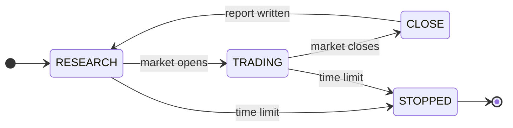

# Architecture

Noctis is one long-running process driven by the market clock. This page covers the phase
loop, the module map, the seam philosophy, the fill model, the trading day, and where state
lives.

## The phase loop



The state machine (`src/noctis/engine/machine.py`) researches while the market is closed, trades
while it is open, and reports at the close — looping until a configured `time_limit_hours` is
reached. The runtime (`src/noctis/engine/runtime.py`) paces ticks in wall-clock time, waits out
weekends, and routes `SIGINT`/`SIGTERM` and the time limit through one clean between-phases
shutdown that flushes state.

## The full pipeline

End to end, a strategy travels one path from raw data to a live paper record:

```
Data (fetch-once lake)
  → Research agent (formulate → match → optimize → decide)
  → Strategy generation (one reviewable .py, validated on write)
  → Backtesting (vectorbt-style pre-filter → walk-forward validation)
  → Out-of-sample validation (temporal holdout + symbol holdout)
  → Promotion (the gate order)
  → Forward paper record (champions trade only bars no tuning ever saw)
```

RESEARCH runs the first five stages while the market is closed; TRADING runs the last while it
is open; CLOSE writes the record and loops back. How a candidate earns promotion — the gate
order and the two out-of-sample axes — is the subject of [validation.md](validation.md).

## Everything heavy is a seam

The heavy engine/research/data stacks (`nautilus_trader`, `vectorbt`, `databento`, `optuna`,
`exchange-calendars`, the LLM SDKs, …) are **optional extras**. Each hides behind a swappable
seam with an in-house default, so the full test suite and bare paper mode run on the core
install alone. When a feature needs a missing package you'll see
`The '<pkg>' package is required … continuing without it` — install the extra named in the
warning (see [development.md](development.md)).

## Module map

| Area | Module | What it does |
|---|---|---|
| 🔐 Config + safety gate | `src/noctis/config` | Typed settings (`config.yaml` + `.env`); the paper/live double gate |
| 🧩 Composition root | `src/noctis/bootstrap.py` | One session-assembly seam: the settings → gate → mandate → CLI-flag precedence chain, plus the shared builders (lake, memory, console, the agent research session) every entrypoint uses instead of hand-wiring |
| 🗄️ Fetch-once data lake | `src/noctis/data` | Parquet catalog + coverage registry + coverage-diffed ingest + tail-only sync + integrity check + cost preflight |
| 📚 Strategy library | `strategies/` + `src/noctis/strategies/library.py` | One `.py` per strategy — thesis, code, tuned params, and research provenance in a docstring header; `write_strategy` validates in a subprocess so a broken file can never land. Three tiers: committed seeds in `strategies/`, plus the workspace's `__tmp/` working files and `champions/` (a later tier overrides an earlier one) |
| 📐 Strategies | `src/noctis/strategies` | `TraderStrategy` base: event-driven `on_bar()` plus a default `signals()` that replays it (parity by construction; a vectorised override stays possible); indicator helpers; SMA / RSI / Donchian worked examples; the candidate proposer |
| 🤖 Agent research | `src/noctis/research` | The agent loop: an LLM drives formulate → match → optimize → decide through a curated tool registry with per-strategy experiment journals and an exhaustion gate on verdicts |
| 🧬 StrategySpec engine | `src/noctis/strategies/spec` | Strategy-as-data (legacy ideation): a JSON graph compiles to a registerable family whose `signals()`/`on_bar()` share one rule evaluator; persists to the state dir's `specs.json` and re-registers at startup |
| 🏦 Broker | `src/noctis/broker` | Paper broker (a SimulatedExchange: fills, slippage, fees, P&L); event simulator; gated live stub |
| ⏪ Backtest | `src/noctis/backtest` | Two-stage pipeline: vectorbt-style pre-filter → walk-forward validation → `Scorecard` |
| 🏆 Champions | `src/noctis/champions` | Persistent registry + pure promotion rules (OOS metric, train−test gap guard) |
| ⚙️ Engine | `src/noctis/engine` | Market clock, state machine, research loop, close orchestration, runtime |
| 📡 Live | `src/noctis/live` | Trading loop + risk manager |
| 📊 Reporting | `src/noctis/reporting` | Close-of-day report, Markdown + structured JSON (`workspace/reports/<date>.md` / `.json`) |
| 🧠 Memory | `src/noctis/memory` | The agent-memory store (load / append / reorganize; lives at `workspace/memory/MEMORY.md`) |

## Two research paths, one contract

The agent loop (`src/noctis/research/agent.py` + the curated `ResearchToolbox`) and the legacy
proposer/Optuna loop return the *same* `ResearchSummary`, so the runtime calls either behind one
seam — no LLM configured means the legacy path runs over the same strategy library, exactly as
before. See [research.md](research.md) for how a strategy earns promotion.

## The fill model

**The base contract: decide on bar *t*, fill at bar *t+1*'s open — and nothing else can create
a fill.** Both backtest stages and the live driver share this single-fill-source rule
(`src/noctis/broker/simulator.py`), and it is what makes the no-lookahead guarantee checkable:
every fill traces to a target decided strictly before the bar that prices it, and fills route
through the normal slippage/fee models, adverse to the trading side.

**Protective exits are the one sanctioned extension** — fixed **stop-loss**, **take-profit**,
and **trailing stop**, all expressed as *percentages* — declared by the strategy alongside its
target, evaluated by the **engine** intrabar against subsequent OHLC. Exits are opt-in and
declarative: the strategy states the rules, the engine enforces them, and the strategy never
observes whether one fired. A strategy remains a pure function of the bars it has seen, so
`signals()`/`on_bar` parity stays about the *target* series and the write gate's replay
semantics are untouched. The four decisions below are **resolved**; the implementation phases
in [protective-exits-plan.md](protective-exits-plan.md) build on them and do not re-litigate
them.

**1. Author API (resolved).** `Context.set_target` grows exactly one keyword-only, defaulted
parameter — source-compatible with every existing strategy file:

```python
@dataclass(frozen=True)
class ExitRules:                      # beside Bar in src/noctis/strategies/base.py
    stop_pct: float | None = None     # exit if adverse move ≥ this fraction of entry
    take_profit_pct: float | None = None
    trail_pct: float | None = None    # exit if drawdown from best-since-entry ≥ this

def set_target(self, target: int, exits: ExitRules | None = None) -> None: ...
```

`TargetContext` captures `exits` alongside `target`. Rules are **re-declared every bar** with
the target — stateless from the strategy's side — and the engine associates them with the
*position*, not the bar. Exit percentages are ordinary `float` params a strategy forwards from
its `Params`, so the research agent tunes `stop_pct`/`take_profit_pct`/`trail_pct` as normal
`ParamSpec`s with no framework change.

**2. Execution semantics — the conservative intrabar policy (resolved).** Per bar *t+1*, in an
order chosen so no step can see a later step's information:

1. **Open** — the pending target from bar *t* executes at the open, exactly as today. If the
   fill opens or flips a position, exit tracking (re)anchors — `entry_price = fill price`,
   `best = entry_price` — and it clears on flat.
2. **Intrabar** — if a position is open and rules are armed, evaluate against the bar's
   high/low under the conservative policy:
   - **Gap-through fills at the open.** If the open is already beyond a level, the exit fills
     at the open — never at the untouched level.
   - **Stop beats take-profit.** Both levels touched within one bar ⇒ assume the stop fired;
     the intrabar path is unknowable from OHLC, so ambiguity resolves to the worst case.
   - **Prior-bar ratchet.** The trailing high-water mark ratchets on the *prior* bar's extreme
     while the trigger evaluates the *current* bar's adverse extreme — ratcheting and
     triggering off the same bar would be intrabar lookahead (the high that sets the mark may
     occur after the low that hits it). Structurally, `evaluate` runs before `ratchet` each
     bar, so the mark is the prior bar's extreme by construction.
   - Exit fills route through the **normal slippage/fee models**, adverse to the closing side.
     Short positions mirror long semantics symmetrically: stop above, take-profit below, and
     the trailing mark is the low-water mark.
3. **Close** — `on_bar` runs (sees the full bar, as today) and sets the next target; equity
   marks at the close.

**3. The re-arm latch (resolved).** After an exit fires, the engine latches that symbol **flat
until the strategy's target series *changes value*** (any transition: `+1→0`, `+1→−1`, …). The
first change un-latches; the new value then executes normally. A target *change* is the
strategy affirmatively re-deciding; a *held* target is stale conviction from before the
stop-out — honoring it would re-enter at the next open and turn every stop into a one-bar
speed bump. The latch mirrors the existing session-halt latch, so operators reason about one
latch shape. The consequence, stated loudly because authors must know it: **a strategy holding
`+1` for weeks treats a stop-out as terminal until its signal cycles.** That is correct — it
is what "the thesis was invalidated" means.

**4. The prefilter stays exit-blind (resolved).** With engine-side exits, realized P&L is no
longer a pure function of the target series, and the vectorised prefilter cannot see exit
fills. It keeps its coarse selection-filter role unchanged; the event-driven walk-forward —
authoritative for the `Scorecard` and every promotion gate — prices exits exactly. Stops are
**never approximated vectorially**; that is where lookahead bugs are born. Gate interaction:
exits change *candidate behavior*, not thresholds — the activity floor, gap guard, holdouts,
and consistency gates apply to exit-bearing candidates unchanged.

**Rollout posture.** Exits are **opt-in by declaration, and that is the only switch** — there
is no config kill-switch, because a knob that silently ignores declared stops would make
backtest and live disagree. A strategy that declares no rules runs a byte-identical code path,
so existing champions stay comparable: no staleness rule, no registry migration. The safety
net for every implementation phase is a golden regression — the three seed strategies (which
declare no exits) byte-identical through `noctis backtest` before and after.

**Refused scope** (re-litigated only as a new plan, never inside this one):

- **Limit/stop *entries* and resting-order management** — they redefine "activity," collide
  with the activity-floor/turnover gates, and open an entry-price overfitting axis.
- **Strategy-visible fills or position state** — a strategy stays a pure function of the bars
  it has seen; exits are rules the engine enforces and the strategy never observes.
- **Sub-timeframe stop evaluation in live** — exits evaluate on the strategy's declared
  timeframe bars, identical to what the backtest scored.
- **Absolute-price exit levels** — percentages only, so one tuned param set stays scale-free
  across a panel of symbols.
- **Any "realistic" intrabar path model** — unfalsifiable from OHLC; it can only flatter a
  backtest. The conservative policy is the only policy.
- **A config kill-switch for exits** — opt-in-by-declaration is the switch (see rollout
  posture above).

## The trading day

While the market is open, champions run on live or replayed bars and emit **paper** orders
through a simulated exchange, within risk limits. Live trading assigns each symbol its
best-scoring eligible champion (champions persist the symbols they were fit on; pre-panel
champions keep trading the whole universe).

**One driver, one feed contract, one settle order.** The session driver polls a `BarFeed`
(`src/noctis/live/feed.py`) — the live yfinance adapter (clock-bounded: the session close ends
the day) or a catalog `ReplayBarFeed` (data-bounded: the slice's exhaustion does) — so live and
replay can never diverge on how a day is traded. However the day ran, `TradingDay`
(`src/noctis/engine/trading_day.py`) settles it the same way: attribute forward P&L (derived
evidence, never blocks), persist the account **first**, advance the session high-water mark
**second** — a crash between the two re-trades the session rather than silently skipping it.
The TRADING entry itself sits behind its own seam: `TradingPhase`
(`src/noctis/engine/trading_phase.py`) assembles the account, forward ledger, and day runner,
resolves live vs replay, runs the catch-up loop, and folds every settled session into one
outcome the runtime copies into its report accumulators — the same interface tests drive
directly with fake bars and feeds.

**Catalog replay is a rolling live-holdout.** Each day trades only the newest session(s) past a
persisted high-water mark (the state dir's `trading_sessions.json`) — bars no tuning ever saw — one
risk-managed session per session date, so results accumulate into a genuine forward track
record. A day with no new lake data skips trading and says so in the report instead of
replaying stale bars.

**The account is one continuous paper account** (the state dir's `paper_account.json`): equity *and* open
positions carry across sessions — overnight gaps are real P&L, and the daily loss limit anchors
to that day's carried starting equity. Champion turnover never resets it; a corrupt state file
refuses to trade rather than silently restarting at 100k. Inspect it with `noctis account`
(also one line in `noctis status`); archive and start fresh with `noctis account --reset`.

**Champion turnover and carried positions.** A symbol *reassigned* to a different champion is
inherited: the new assignee starts from the carried position and re-decides at its first bar
(realized/unrealized attribution follows the inheritor). A position whose symbol **no** current
champion is eligible for is an **orphan** — unmanaged by anyone — and each session flattens
orphans at their first tradable bar through the normal risk/broker path (allowed even under the
daily-loss halt: it is risk-reducing). The closing P&L is credited to the champion that opened
the position via the forward ledger's recorded holder, and the flatten is named in the close
report.

## At the close

Noctis writes a report (`workspace/reports/<date>.md` + `.json`), syncs its data catalog
(tail-only), reconciles live-built bars against the authoritative catalog (see
[data.md](data.md)), reorganizes its own memory, and loops back to research.

## Where state lives

One contract: **the operator surface is committed templates/scaffold plus local, gitignored
copies; everything the engine writes lands under `workspace/`** (one knob, `workspace_dir`,
env `NOCTIS_WORKSPACE`). `noctis init` scaffolds the local copies; `noctis migrate` moves a
pre-workspace layout in; a startup guard refuses to run beside un-migrated legacy data.

**The operator surface (input — the engine treats all of it as read-only):**

| Path | What | Git |
|---|---|---|
| `config.example.yaml` → `config.yaml` | Every operating knob: committed template → your local copy (optional; defaults apply without it) | template **committed**; local copy ignored |
| `.env.example` → `.env` | Secrets + the `ALLOW_LIVE` gate | template **committed**; local copy ignored |
| `strategies/*.py` | The seed library — `TEMPLATE.py` + three worked examples, one reviewable `.py` per strategy with its research record in the header (see `strategies/README.md`) | **committed** |
| `mandate/` | Operator mandate scaffold — `MANDATE.md.example`, five shipped profiles, `tune-first` (see `mandate/README.md`) | **committed** (scaffold only) |
| `mandate/MANDATE.md` + custom personalities + personal `references/` | The operator's own steering input | ignored |
| `MEMORY.seed.md` | Curated starting lessons — copied into the live memory on first run | **committed** |

**The workspace (output — git never sees inside it):**

| Path | What |
|---|---|
| `workspace/state/champions.json` | The champion registry |
| `workspace/state/paper_account.json` | The continuous paper account |
| `workspace/state/trading_sessions.json` | The replay high-water mark |
| `workspace/state/experiments/<strategy>.jsonl` | Per-strategy experiment journals, one line per backtest/sweep trial |
| `workspace/state/specs.json` | LLM-minted `StrategySpec` definitions, re-registered at startup |
| `workspace/data_lake/` | Parquet catalog + `coverage.db` + `manifest.json` |
| `workspace/reports/YYYY-MM-DD.md` + `.json` | Close-of-day reports, human- and machine-readable |
| `workspace/memory/MEMORY.md` | The agent's own live long-term memory (the agent maintains it) |
| `workspace/strategies/__tmp/` | The research agent's working files (drafts, candidates, rejects) |
| `workspace/strategies/champions/` | Locally-promoted champions (never reach the public repo) |
