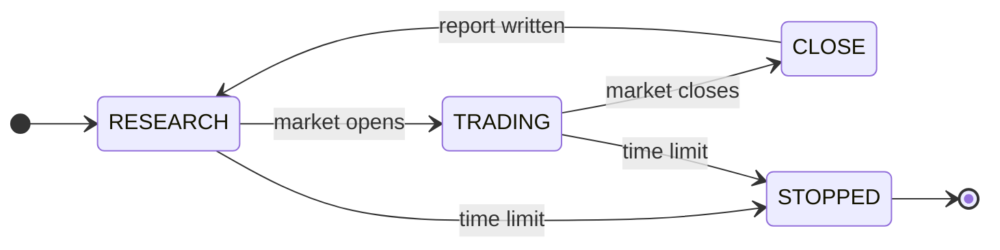

# Architecture

Noctis is one long-running process driven by the market clock. This page covers the phase
loop, the module map, the seam philosophy, the fill model, the trading day, and where state
lives.

## The phase loop


```mermaid
stateDiagram-v2
    direction LR
    [*] --> RESEARCH
    RESEARCH --> TRADING: market opens
    TRADING --> CLOSE: market closes
    CLOSE --> RESEARCH: report written
    RESEARCH --> STOPPED: time limit
    TRADING --> STOPPED: time limit
    STOPPED --> [*]
```

The state machine (`src/noctis/engine/machine.py`) researches while the market is closed, trades
while it is open, and reports at the close — looping until a ceiling is reached. There are two,
and they stop through the *same* move: `time_limit_hours` bounds **this process** (how long
tonight lasts, leaving the run resumable), and `run_limit_hours` bounds the **whole run** across
every stop/resume, marking it `completed` at the cap so two runs can be compared on equal compute
([cli.md](cli.md#bounding-a-run----run-limit-hours-and---finish)). The runtime
(`src/noctis/engine/runtime.py`) paces ticks in wall-clock time, waits out weekends, and routes
`SIGINT`/`SIGTERM` and both ceilings through one clean between-phases shutdown that flushes
state — deliberately one route, so a new way to stop can never behave differently from the one an
operator already trusts.

## The full pipeline

End to end, a strategy travels one path from raw data to a live paper record:

```
Data (fetch-once lake)
  → Research agent (formulate → match → optimize → decide)
  → Strategy generation (one reviewable .py, validated on write)
  → Backtesting (vectorbt-style pre-filter → walk-forward validation)
  → Out-of-sample validation (temporal holdout + symbol holdout)
  → Promotion (the gate order)
  → Forward paper record (champions trade only bars no tuning ever saw)
```

RESEARCH runs the first five stages while the market is closed; TRADING runs the last while it
is open; CLOSE writes the record and loops back. How a candidate earns promotion — the gate
order and the two out-of-sample axes — is the subject of [validation.md](validation.md).

## Everything heavy is a seam

The heavy engine/research/data stacks (`nautilus_trader`, `vectorbt`, `databento`, `optuna`,
`exchange-calendars`, the LLM SDKs, …) are **optional extras**. Each hides behind a swappable
seam with an in-house default, so the full test suite and bare paper mode run on the core
install alone. When a feature needs a missing package you'll see
`The '<pkg>' package is required … continuing without it` — install the extra named in the
warning (see [development.md](development.md)).

## Module map

| Area | Module | What it does |
|---|---|---|
| 🔐 Config + safety gate | `src/noctis/config` | Typed settings (`config.yaml` + `.env`); the paper/live double gate |
| 🧩 Composition root | `src/noctis/bootstrap.py` | One session-assembly seam: the settings → gate → mandate → CLI-flag precedence chain (`resolve_session`), the run segment's one entry (`open_segment`), plus the shared builders (lake, memory, the event sink, the agent research session) every entrypoint uses instead of hand-wiring |
| 🗄️ Fetch-once data lake | `src/noctis/data` | Parquet catalog + coverage registry + coverage-diffed ingest + tail-only sync + integrity check + cost preflight |
| 📚 Strategy library | `strategies/` + `src/noctis/strategies/library.py` | One `.py` per strategy — thesis, code, tuned params, and research provenance in a docstring header; `write_strategy` validates in a subprocess so a broken file can never land. Three tiers: committed seeds in `strategies/`, plus the run's `__tmp/` working files and `champions/` (a later tier overrides an earlier one) |
| 📐 Strategies | `src/noctis/strategies` | `TraderStrategy` base: event-driven `on_bar()` plus a default `signals()` that replays it (parity by construction; a vectorised override stays possible); indicator helpers; SMA / RSI / Donchian worked examples; the candidate proposer |
| 🤖 Agent research | `src/noctis/research` | The agent loop: an LLM drives formulate → match → optimize → decide through a curated tool registry with per-strategy experiment journals and an exhaustion gate on verdicts |
| 🧬 StrategySpec engine | `src/noctis/strategies/spec` | Strategy-as-data (legacy ideation): a JSON graph compiles to a registerable family whose `signals()`/`on_bar()` share one rule evaluator; persists to the state dir's `specs.json` and re-registers at startup |
| 🏦 Broker | `src/noctis/broker` | Paper broker (a SimulatedExchange: fills, slippage, fees, P&L); event simulator; gated live stub |
| ⏪ Backtest | `src/noctis/backtest` | Two-stage pipeline: vectorbt-style pre-filter → walk-forward validation → `Scorecard` |
| 🏆 Champions | `src/noctis/champions` | Persistent registry + pure promotion rules (OOS metric, train−test gap guard, one slot per family) |
| ⚙️ Engine | `src/noctis/engine` | Market clock, state machine, research loop, close orchestration, runtime |
| 📡 Live | `src/noctis/live` | Trading loop + risk manager |
| 📊 Reporting | `src/noctis/reporting` | Close-of-day report, Markdown + structured JSON (`<run>/reports/<date>.md` / `.json`) + the run record/store |
| 🧠 Memory | `src/noctis/memory` | The agent-memory store (load / append / reorganize; lives at `<run>/memory/MEMORY.md`) |
| 🧪 Eval layer | `src/noctis/eval` | Benchmark infrastructure for the LLM judgment sites: one `AgentSite` declaration per site, the ablation `HarnessSpec`, per-site knobs and identity. **One-way**: it imports the engine, the engine never imports it (below) |

## Two research paths, one contract

The agent loop (`src/noctis/research/agent.py` + the curated `ResearchToolbox`) and the legacy
proposer/Optuna loop return the *same* `ResearchSummary`, so the runtime calls either behind one
seam — no LLM configured means the legacy path runs over the same strategy library, exactly as
before. Every reader of that toolbox holds one declared surface (`src/noctis/research/surface.py`),
in two tiers: `ResearchFacts` — the derived facts a *renderer* reads (the briefings, the system
prompt, an eval site rebuilding a past ask) — and `Toolbox`, which adds the tools, the capture seams
and the counters snapshot a *driver* needs. A consumer reads facts, never the collaborator behind
one, and `tests/test_toolbox_boundary.py` is the check that it stays that way. The agent
loop itself runs one of two ways behind a further seam — the **conversation**
transcript or the small-context **episodic** driver — and the episodic path adds the
machine-fixed scenario oracle (FORMULATE authors the tape, the coder only satisfies it; see
[research.md](research.md)). See [research.md](research.md) for how a strategy earns promotion.

## The eval layer, and why it is one-way

The engine's LLM judgment sites are declared as data in `src/noctis/eval/` — one frozen
`AgentSite` per site naming its emit contract, the production builder its prompt is rendered by,
the knobs a bench may override, and a hand-bumped `version` — so a benchmark has something to look
up instead of re-deriving a prompt. Five sites are declared (`coder`, `formulate`, `decide`,
`discover`, `distill`); the conversation loop and onboarding-verify are deliberately undeclared and
the registry says why (a transcript is not a function of disk — it is measured end-to-end by the
parity harness; a liveness check is not a judgment).

**The layer imports the engine; the engine never imports the layer.** A benchmark measures
production, so production must not depend on it — otherwise a bench-only ablation (the contract
sheet off, the worked example swapped) becomes reachable from a real research session, and every
run afterwards is a run whose prompt composition nobody can state from the record alone. The
one-way rule is enforced structurally, by an import-isolation guard that fails CI naming the
offending module and line, and by the ablation dials living in a type production config has no word
for. See
[development.md → the eval boundary](development.md#the-eval-boundary-and-its-import-guard).

## Validation-on-write: the shared funnel and the Tier-1 invariants

`write_strategy` (`src/noctis/strategies/library.py`) is the one gate every authored file passes,
and it validates in a **fresh subprocess** (clean import → smoke replay → scenario replay →
`signals`/`on_bar` parity) so a broken or non-deterministic file can never land or poison an
import cache. The scenario replay is the file's own correctness oracle — its declared
known-outcome tapes — and each tape additionally runs the **Tier-1 invariant suite**
(`src/noctis/strategies/scenarios.py`, `check_invariants`): one extensible, ordered chain of pure
structural-honesty checks replayed over every tape, so both validator runners inherit every check
with no drift.

1. **Warmup honesty** — no nonzero target before the strategy's declared `warmup_bars(params)`;
   a default of `0` is undeclared and exempt (strategies outside the library are untouched).
2. **Determinism** — a second replay must produce an identical target series (it gates the
   replay-and-compare checks below, which a non-deterministic strategy would make meaningless).
3. **Truncation no-lookahead** — `signals(tape[:k]) == signals(tape)[:k]` at a handful of cut
   points: a vectorised `signals()` override that peeks at the future (a centered window, a
   full-series `max`/`mean`, a `shift(-k)`) is exposed by a prefix decision that changes when
   later bars are removed. The event `on_bar` path is causal by construction.
4. **Price-scale invariance** — scaling every price column ×10 must leave the target series
   unchanged, so an absolute-price threshold (which can't transfer across a symbol panel) is a
   structural defect, not a scale-free feature.

**The tolerant-both write gate.** `write_strategy` takes an optional compiled scenario spec. With
**no spec** (a hand-written source, the conversation loop) the path is byte-identical to before —
the file's own `scenarios()` are validated as authored. With a **spec** (the episodic driver's
fixed oracle) the gate resolves `warm` from the candidate's *own* declared warmup, replays the
compiled oracle at that warmup, **rejects** any coder-authored `scenarios()` block, and — on
success — machine-stamps a warmup-parametric `scenarios()` into the installed file. Either way one
validated file lands; the spec path just moves who authors the tape from the coder to the machine.

**Where the compiler sits.** The scenario spec vocabulary and the pure compiler
(`src/noctis/strategies/scenario_spec.py`: `LegSpec` / `Behavior` / `ScenarioSpec` / `SpecSuite`,
`compile_spec`, `describe_spec`) live in the **strategy layer**, not the research layer.
Compilation is a pure, deterministic function of `(spec, warm)` — no LLM, no I/O, no clock, no
randomness — and the module imports nothing from `noctis.research`, so the same spec always
compiles to the same `Scenario` objects and the gate owns the oracle independently of who proposed
it.

## The fill model

**The base contract: decide on bar *t*, fill at bar *t+1*'s open — and nothing else can create
a fill.** That step order lives in exactly one module — `PositionDriver`
(`src/noctis/broker/position_driver.py`), the single fill source, with two drivers: the backtest
simulator and the live trading day, which differ only in what they pass in (the sizer, the
execute guards, the bar timing) and never in the order of the steps. It is what makes the
no-lookahead guarantee checkable: every fill traces to a target decided strictly before the bar
that prices it, and fills route through the normal slippage/fee models, adverse to the trading
side.

**Protective exits are the one sanctioned extension** — fixed **stop-loss**, **take-profit**,
and **trailing stop**, all expressed as *percentages* — declared by the strategy alongside its
target, evaluated by the **engine** intrabar against subsequent OHLC. Exits are opt-in and
declarative: the strategy states the rules, the engine enforces them, and the strategy never
observes whether one fired. A strategy remains a pure function of the bars it has seen, so
`signals()`/`on_bar` parity stays about the *target* series and the write gate's replay
semantics are untouched. The four decisions below are **resolved**; the implementation phases
in [protective-exits-plan.md](plans/protective-exits-plan.md) build on them and do not re-litigate
them.

**1. Author API (resolved).** `Context.set_target` grows exactly one keyword-only, defaulted
parameter — source-compatible with every existing strategy file:

```python
@dataclass(frozen=True)
class ExitRules:  # beside Bar in src/noctis/strategies/base.py
    stop_pct: float | None = None  # exit if adverse move ≥ this fraction of entry
    take_profit_pct: float | None = None
    trail_pct: float | None = None  # exit if drawdown from best-since-entry ≥ this


def set_target(self, target: int, exits: ExitRules | None = None) -> None: ...
```

`TargetContext` captures `exits` alongside `target`. Rules are **re-declared every bar** with
the target — stateless from the strategy's side — and the engine associates them with the
*position*, not the bar. Exit percentages are ordinary `float` params a strategy forwards from
its `Params`, so the research agent tunes `stop_pct`/`take_profit_pct`/`trail_pct` as normal
`ParamSpec`s with no framework change.

**2. Execution semantics — the conservative intrabar policy (resolved).** Per bar *t+1*, in an
order chosen so no step can see a later step's information:

1. **Open** — the pending target from bar *t* executes at the open, exactly as today. If the
   fill opens or flips a position, exit tracking (re)anchors — `entry_price = fill price`,
   `best = entry_price` — and it clears on flat.
2. **Intrabar** — if a position is open and rules are armed, evaluate against the bar's
   high/low under the conservative policy:
   - **Gap-through fills at the open.** If the open is already beyond a level, the exit fills
     at the open — never at the untouched level.
   - **Stop beats take-profit.** Both levels touched within one bar ⇒ assume the stop fired;
     the intrabar path is unknowable from OHLC, so ambiguity resolves to the worst case.
   - **Prior-bar ratchet.** The trailing high-water mark ratchets on the *prior* bar's extreme
     while the trigger evaluates the *current* bar's adverse extreme — ratcheting and
     triggering off the same bar would be intrabar lookahead (the high that sets the mark may
     occur after the low that hits it). Structurally, `evaluate` runs before `ratchet` each
     bar, so the mark is the prior bar's extreme by construction.
   - Exit fills route through the **normal slippage/fee models**, adverse to the closing side.
     Short positions mirror long semantics symmetrically: stop above, take-profit below, and
     the trailing mark is the low-water mark.
3. **Close** — `on_bar` runs (sees the full bar, as today) and sets the next target; equity
   marks at the close.

**3. The re-arm latch (resolved).** After an exit fires, the engine latches that symbol **flat
until the strategy's target series *changes value*** (any transition: `+1→0`, `+1→−1`, …). The
first change un-latches; the new value then executes normally. A target *change* is the
strategy affirmatively re-deciding; a *held* target is stale conviction from before the
stop-out — honoring it would re-enter at the next open and turn every stop into a one-bar
speed bump. The latch mirrors the existing session-halt latch, so operators reason about one
latch shape. The consequence, stated loudly because authors must know it: **a strategy holding
`+1` for weeks treats a stop-out as terminal until its signal cycles.** That is correct — it
is what "the thesis was invalidated" means.

**4. The prefilter stays exit-blind (resolved).** With engine-side exits, realized P&L is no
longer a pure function of the target series, and the vectorised prefilter cannot see exit
fills. It keeps its coarse selection-filter role unchanged; the event-driven walk-forward —
authoritative for the `Scorecard` and every promotion gate — prices exits exactly. Stops are
**never approximated vectorially**; that is where lookahead bugs are born. Gate interaction:
exits change *candidate behavior*, not thresholds — the activity floor, gap guard, holdouts,
consistency and one-slot-per-family gates apply to exit-bearing candidates unchanged (declaring
a stop is not a new thesis, so it never buys a crowned family a second slot).

**Rollout posture.** Exits are **opt-in by declaration, and that is the only switch** — there
is no config kill-switch, because a knob that silently ignores declared stops would make
backtest and live disagree. A strategy that declares no rules runs a byte-identical code path,
so existing champions stay comparable: no staleness rule, no registry migration. The safety
net for every implementation phase is a golden regression — the three seed strategies (which
declare no exits) byte-identical through `noctis backtest` before and after.

**Refused scope** (re-litigated only as a new plan, never inside this one):

- **Limit/stop *entries* and resting-order management** — they redefine "activity," collide
  with the activity-floor/turnover gates, and open an entry-price overfitting axis.
- **Strategy-visible fills or position state** — a strategy stays a pure function of the bars
  it has seen; exits are rules the engine enforces and the strategy never observes.
- **Sub-timeframe stop evaluation in live** — exits evaluate on the strategy's declared
  timeframe bars, identical to what the backtest scored.
- **Absolute-price exit levels** — percentages only, so one tuned param set stays scale-free
  across a panel of symbols.
- **Any "realistic" intrabar path model** — unfalsifiable from OHLC; it can only flatter a
  backtest. The conservative policy is the only policy.
- **A config kill-switch for exits** — opt-in-by-declaration is the switch (see rollout
  posture above).

## The trading day

While the market is open, champions run on live or replayed bars and emit **paper** orders
through a simulated exchange, within risk limits. Live trading assigns each symbol its
best-scoring eligible champion (champions persist the symbols they were fit on; pre-panel
champions keep trading the whole universe).

**One driver, one feed contract, one settle order.** The session driver polls a `BarFeed`
(`src/noctis/live/feed.py`) — the live yfinance adapter (clock-bounded: the session close ends
the day) or a catalog `ReplayBarFeed` (data-bounded: the slice's exhaustion does) — so live and
replay can never diverge on how a day is traded. However the day ran, `TradingDay`
(`src/noctis/engine/trading_day.py`) settles it the same way: attribute forward P&L (derived
evidence, never blocks), persist the account **first**, advance the session high-water mark
**second** — a crash between the two re-trades the session rather than silently skipping it.
The TRADING entry itself sits behind its own seam: `TradingPhase`
(`src/noctis/engine/trading_phase.py`) assembles the account, forward ledger, and day runner,
resolves live vs replay, runs the catch-up loop, and folds every settled session into one
outcome the runtime copies into its report accumulators — the same interface tests drive
directly with fake bars and feeds.

**Catalog replay is a rolling live-holdout.** Each day trades only the newest session(s) past a
persisted high-water mark (the state dir's `trading_sessions.json`) — bars no tuning ever saw — one
risk-managed session per session date, so results accumulate into a genuine forward track
record. A day with no new lake data skips trading and says so in the report instead of
replaying stale bars.

**The account is one continuous paper account** (the state dir's `paper_account.json`): equity *and* open
positions carry across sessions — overnight gaps are real P&L, and the daily loss limit anchors
to that day's carried starting equity. Champion turnover never resets it; a corrupt state file
refuses to trade rather than silently restarting at 100k. Inspect it with `noctis account`
(also one line in `noctis status`); archive and start fresh with `noctis account --reset`.

**Champion turnover and carried positions.** A symbol *reassigned* to a different champion is
inherited: the new assignee starts from the carried position and re-decides at its first bar
(realized/unrealized attribution follows the inheritor). A position whose symbol **no** current
champion is eligible for is an **orphan** — unmanaged by anyone — and each session flattens
orphans at their first tradable bar through the normal risk/broker path (allowed even under the
daily-loss halt: it is risk-reducing). The closing P&L is credited to the champion that opened
the position via the forward ledger's recorded holder, and the flatten is named in the close
report.

## At the close

Noctis writes a report (`<run>/reports/<date>.md` + `.json`), syncs its data catalog
(tail-only), reconciles live-built bars against the authoritative catalog (see
[data.md](data.md)), reorganizes its own memory, and loops back to research.

## Where state lives

One contract: **the operator surface is committed templates/scaffold plus local, gitignored
copies; everything the engine writes lands under `workspace/`** (one knob, `workspace_dir`,
env `NOCTIS_WORKSPACE`) — and inside it, **a run owns its state**. `noctis init` scaffolds the
local copies; `noctis migrate` moves a pre-workspace layout in and adopts pre-run-scoped
workspace state into the reserved `legacy` run; a startup guard refuses to run beside abandoned
pre-workspace data and warns beside un-adopted workspace state.

```
workspace/
  data_lake/                  ← SHARED across runs. Vendor data is expensive and run-neutral.
  runs/
    index.json                ← the derived listing roll-up
    <run_id>/
      run.json  run.lock      ← the record and the liveness lock
      state/                  ← champions.json, paper_account.json, forward_ledger.json,
                                 specs.json, sessions/, experiments/
      strategies/             ← this run's __tmp/ and champions/ tiers
      memory/MEMORY.md        ← seeded from the committed MEMORY.seed.md at run creation
      reports/                ← this run's per-day close reports
      qa/                     ← the --debug tree
```

Two runs in one workspace therefore cannot crown champions onto one board or trade one paper
account, and a run's numbers describe only what that run produced — which is why every record
states `assumptions.state_scope: "run"`, so a comparison between two runs is a comparison of two
experiments rather than of two views of one board. The four per-run paths
(`state_dir`, `reports_dir`, `qa_dir`, `memory_path`) derive from `run_dir` in
`config/settings.py`; opening a segment (`bootstrap.open_segment` → `open_run_store`) rebinds
`run_dir` to the run it just minted or resumed, so no command body does path arithmetic. `run_dir`
defaults to the reserved `runs/legacy/` run — what an invocation that never opened a run reads
(`status`, `champions`, `account`, `report`), and the run `noctis migrate` adopts existing state
into. The **committed `strategies/` seeds stay read-only input for every run**: the three-tier
discovery contract (seeds → `__tmp/` → `champions/`) is unchanged; only the two writable tiers
moved under the run.

**The operator surface (input — the engine treats all of it as read-only):**

| Path | What | Git |
|---|---|---|
| `config.example.yaml` → `config.yaml` | Every operating knob: committed template → your local copy (optional; defaults apply without it) | template **committed**; local copy ignored |
| `.env.example` → `.env` | Secrets + the `ALLOW_LIVE` gate | template **committed**; local copy ignored |
| `strategies/*.py` | The seed library — `TEMPLATE.py` + three worked examples, one reviewable `.py` per strategy with its research record in the header (see `strategies/README.md`) | **committed** |
| `mandate/` | Operator mandate scaffold — `MANDATE.md.example` (a balanced Sortino swing brief), five shipped profiles, `tune-first`, `references/` (see `mandate/README.md`) | **committed** (scaffold only) |
| `mandate/MANDATE.md` + custom personalities + personal `references/` | The operator's own steering input | ignored |
| `MEMORY.seed.md` | Curated starting lessons — copied into `<run>/memory/MEMORY.md` at **every** run's creation, so each run starts from the same lessons and grows its own | **committed** |

**The workspace (output — git never sees inside it):**

| Path | What |
|---|---|
| `workspace/data_lake/` | Parquet catalog + `coverage.db` + `manifest.json` — **shared by every run** |
| `workspace/runs/index.json` | The derived listing roll-up over every run record |
| `<run>/run.json` + `run.lock` | One run's self-describing record and its liveness lock |
| `<run>/state/champions.json` | That run's champion registry |
| `<run>/state/paper_account.json` | That run's continuous paper account |
| `<run>/state/equity_curve.jsonl` | That run's daily equity marks + per-session trade log (append-only; the run record's curve is re-derived from it) |
| `<run>/state/trading_sessions.json` | That run's replay high-water mark |
| `<run>/state/experiments/<strategy>.jsonl` | Per-strategy experiment journals, one line per backtest/sweep trial |
| `<run>/state/specs.json` | LLM-minted `StrategySpec` definitions, re-registered at startup |
| `<run>/reports/YYYY-MM-DD.md` + `.json` | Close-of-day reports, human- and machine-readable |
| `<run>/memory/MEMORY.md` | That run's live long-term memory, seeded from `MEMORY.seed.md` |
| `<run>/strategies/__tmp/` | The research agent's working files (drafts, candidates, rejects) |
| `<run>/strategies/champions/` | Locally-promoted champions (never reach the public repo) |

(`<run>` is `workspace/runs/<run_id>/`.)

## What the record says about a run's machine and its inputs

`run.json` is written by three modules with one boundary between them: `reporting/run_store.py`
does every read and the one write, `reporting/run_record.py` is a **pure** builder over what was
collected, and `reporting/schema.py` is a pure validator. This section is *why* those sections
exist and how they are produced; the field-by-field contract — every key, when it is `null`, the
versioning promise, the caps, and a worked example — is [run-record.md](run-record.md).

**One entry opens a run segment: `bootstrap.open_segment`.** A segment is one process's stretch of
work on a run, and its lifecycle is written once, in the composition root: take the lock, mint or
resume the id, freeze the inputs, record every engine-change note, build the `--debug` recorder and
the event sink, hand the work a `Segment`, then close with a stop reason and its counters and
release the lock — on every exit path, including the ones that never reached the work (a body that
reported nothing closes at `startup`, with no counters, never zeros). Both verbs that open a run —
`noctis run` and `noctis research` — open through it and differ only in what they drive and what
they echo, so a lock-release fix can no longer land in one verb and be missed in the other. The
band imports no Typer: a live lock leaves as the typed `RunLockedError`, and mapping it to red text
and an exit code is the CLI's job. During the work, `Segment.checkpoint` is the day loop's
`on_cycle_close` seam — the incremental record write that keeps a multi-week run's evidence
current on disk.

**`segments[].environment` — per segment, never per run.** Each process invocation records the
machine it actually ran on: hardware (CPU model, physical/logical cores, max frequency, total RAM,
free disk), OS (system, release, arch, container), python and noctis versions, git state (commit,
branch, dirty, describe), the `uv.lock` digest, the optional extras present, and the seams that
degraded. It is per segment because a run is stopped each morning and resumed each night and may
migrate machines in between — and research throughput is CPU-bound (the sweep fork pool, the
walk-forward splits), so trials-per-hour and USD-per-champion only compare across runs when the
hardware behind each is on the record. `environment_latest` is **derived** from the segments, so a
consumer showing "the machine this run is on" reads one key that cannot disagree with them.

`observability/environment.py` shapes the block and nothing else: every probe is **injected**
(hostname, OS facts, hardware, versions, git, lockfile, extras), and the real ones are wired once
in `bootstrap.build_environment_probes`. So the module reads no hardware, shells out to no `git`
and imports no optional package — and the test suite needs none of them either.

Degradation is the ordinary case, and it is explicit. **`psutil` is an optional extra
(`hardware`), never a core dependency**: without it the stdlib subset answers what it can and the
rest is `null`. Git degrades to `null` outside a repository, and so does the lockfile digest. Every
absent value is an explicit `null` **and** the missing capability is named in `degraded_seams`, so
a reader can tell "this machine had no `psutil`" from "this schema version had no such field". The
extra names are exactly the ones `noctis setup` probes for, so a missing extra and a degraded seam
are one notion — and the remedy (`uv sync --extra <name>`) is one an operator can type. The
hostname is stored **hashed** (`sha256[:12]`, the same digest `run.lock` writes, through the same
function): two segments on one machine are provably the same host, without publishing a name.

**`inputs` — the frozen provenance block.** The run's own configuration, pinned at creation and
restored on every resume (`config/rehydrate.py`): the mandate as **resolved text** plus its applied
overlay and digest, the secret-excluded settings dump with its digest and the three tier lists, the
gate's verdict, and `config_epoch`/`config_changes`. **Every verb that opens a run arms the safety
gate** — `research` as well as `run` — so a run minted by a research session freezes
`inputs.execution_mode: "paper"` and `assumptions.paper_only: true` rather than "nobody measured":
the session places no order itself, but the run it mints may trade on a later `run --resume`, and
no verb may be a silent downgrade (`mode: live` without `ALLOW_LIVE` refuses at startup in both).
`null` there means only an adopted history that froze no verdict. Beside them sit two derived
views — `inputs.models` (which model researches, authors, escalates and ideates; the resolved
research loop; the declared context window; the cost profile) and `inputs.data` (provider, dataset,
and the shared workspace-level lake directory) — stated once, resolved, so nothing downstream
rebuilds a fallback chain to know what produced a run's numbers. No credential is reachable from
any of it: a model name is public, and the keys are secret tier and excluded from the record
entirely, which is why a resumed run takes its keys from the live `.env` (see
[safety.md](safety.md)).

**`strategies[]` — everything considered, and the gate that stopped it.** One entry per candidate,
not per champion: *"47 of 66 candidates died at the symbol-holdout gate"* is the sentence that
makes these results credible where an equity curve does not, and it is computable only when the
rejections are on the record in the same shape as the promotions. Each entry carries its name,
outcome (`promoted` / `rejected` / `undecided`), library tier, decision stamp, journaled trials,
the prose rationale — and `gates[]`, the structured evidence `champions/promotion.py` produced.

- **`gates[]` is `(gate, passed, observed, threshold, note)` per gate, in gate order.** It is
  carried *beside* the decision and read by nothing in it: `decide()`'s early returns, order and
  outcomes are exactly what they were before the evidence existed (a committed decision corpus
  proves it case by case), and the promotion path imports nothing from `noctis.reporting` — a test
  asserts that in a fresh subprocess. Evidence, never a gate (AGENTS.md rule 2).
- **A rejection short-circuits, so the list is the gates *reached* plus the one that failed.** An
  absent gate means "never reached", never "passed"; a gate that could not bite — switched off by
  a zero threshold, or handed a metric the scorecard never carried — is still listed, with a note
  saying which, so the funnel's denominators are honest.
- **Champion sources are embedded in full; everyone else is a reference.** `source_path` (relative
  to the run directory, so it stays portable) plus `source_sha256`, with `source: null`. That is
  what holds a two-week run's record to a couple of hundred kilobytes
  (`schema.RECORD_SIZE_BUDGET_BYTES`, held by a test on a synthetic fortnight) instead of
  megabytes. The cost is stated rather than hidden: a rejected candidate's code is readable while
  the run's own `strategies/__tmp/` tier survives, and `run.state_pruned` says when it no longer
  does — what the record *embeds* survives a prune. `noctis run --embed-all-sources` archives a run
  whole, frozen at creation like every other knob that says what a run is.
- **Derived at every write**, from the run's own champion board (which journals each decision's
  gates), its experiment journals and its strategy tiers — never a list carried across a restart,
  so three short segments report exactly what one long one does.

**`sessions[]` and `performance` — the realised paper account, kept apart from the backtest.**
Two sections, one rule: what the paper account actually did is never blended with what a backtest
said it would do. `sessions[]` is the evidence — one entry per closed session, carrying the
account's equity mark for that date, its own start/end equity, orders submitted, closing positions
and its **trade log**, where every fill states its timestamp, fees, modelled slippage and the
**champion** the symbol was assigned when it filled. `performance` is what that evidence computes
to, and it names itself `source: "paper_account"` so no consumer can present it as a scorecard. The
backtest numbers stay in the other section entirely: a candidate's are the `observed` values inside
`strategies[].gates[]`, beside the `threshold` each was measured against, and nothing from a
scorecard is ever mixed into the realised block.

- **The curve is derived, never appended to.** At each CLOSE the engine writes one dated mark to
  the run's own account ledger (`<run>/state/equity_curve.jsonl`, append-only, one mark per date
  with the last write winning), and the record re-reads the whole ledger at every write. Nothing
  about the curve survives a restart in memory, which is why a run stopped and resumed three times
  publishes exactly the curve one long night would — the epic's D4 rule, at its sharpest.
- **`reporting/metrics.py` is a new pure module, deliberately not part of `scorecard.py`.**
  CAGR, annualised volatility, Sortino, Calmar, drawdown depth *and* duration, recovery factor,
  profit factor, expectancy, payoff ratio, win/loss rates, exposure, turnover, monthly returns,
  skew, kurtosis, PSR and DSR. `scorecard.py` feeds the promotion gates, so nothing computed for
  reporting may drift into gate math (AGENTS.md rule 2) — the two are allowed to differ (this
  Sortino uses the full-sample downside deviation, the scorecard's the negative-only one) and a
  test proves the promotion path cannot reach `noctis.reporting` at all.
- **The Deflated Sharpe Ratio, beside the count that deflated it.** DSR corrects the headline
  Sharpe for selection under multiple testing, and the multiple-testing count is the run's **own
  cumulative trial count** — the very lines the exhaustion gate reads off the experiment journals.
  It is published with `n_trials_used` next to it, so the deflation is auditable from the record
  alone. This is the number this project is uniquely able to compute honestly.
- **A benchmark that costs nothing.** `equal_weight_universe_bh` — named so nobody mistakes it for
  an index — is equal-weight buy-and-hold over the symbols the run actually traded, priced from
  bars **already in the shared lake** over the run's own session window, with alpha, beta,
  information ratio, tracking error and correlation. No vendor call and no new spend: a symbol the
  lake does not hold is not benchmarked, and the block carries `null`s with a note saying why.
  Only statistics reach the record — the benchmark's own price series never does.
- **A run that never traded reports `traded: false` and `performance: null`** — not zeros
  (epic D10), so a website renders "researching" rather than a flat 0% curve it was handed as a
  result. The schema enforces the pairing.
